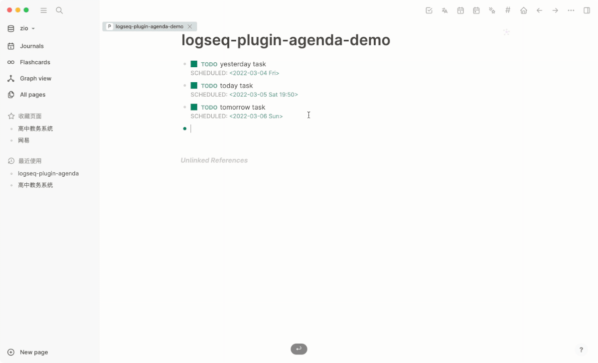
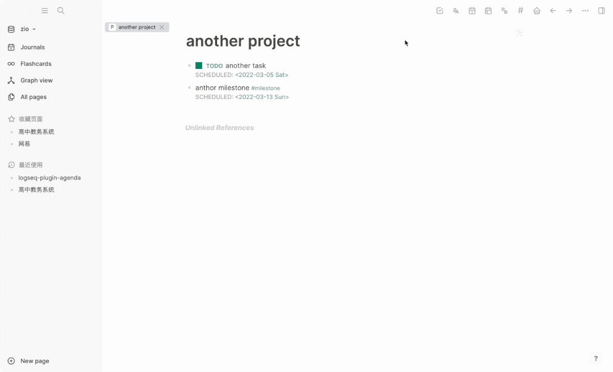

# logseq-plugin-agenda
> A plugin for logseq to show agenda

[](https://github.com/haydenull/logseq-plugin-agenda/releases)
[](https://github.com/haydenull/logseq-plugin-agenda/blob/main/LICENSE)

[English](./README.md) | 简体中文

## 功能
- 支持多种视图: 单日 周 双周 月
- 支持设置周开始日期
- 支持非常灵活的自定义日历
- 支持显示过期任务
- 支持显示里程碑
- 支持收集每日日志, 导出周报
- 支持深色模式

## Demo

我们将带有 `"TODO" "DOING" "NOW" "LATER" "WAITING" "DONE"` 的笔记称作任务。其他笔记称作日程。
### 展示所有笔记中的任务

journal 日历会收集所有设置了`scheduled` 或 `deadline`的任务，并且以`scheduled` `deadline`为开始时间。

当 `scheduled` `deadline` 设置了时间时, 会认为是 `time` 任务。会显示在时间线中。

否则认为是 `allday` 任务。

### 创建自己的日历


### 展示日记中的任务

journal 日历会收集所有 journals 中的没有 `scheduled` `deadline` 的任务，并且以 journals 的日期为任务时间。

它会被认作 `allday` 任务。

### 展示每日日志


## 设置

### Default View
默认视图

### Week Start Day
周开始日

### Journal Date Formatter
日记日期格式

依据自己每日日记的格式填写,例如我的日记是 `2022-03-07 Mon`,那么就填写 `YYYYMMDD ddd`

[文档](https://day.js.org/docs/en/display/format)

### Log Key
每日日志的关键字

插件会依据该关键字,将所有日记中该 block 下的内容收集起来, 在日历中展示

有以下三种情况:
1. 具有时间点的 block, 如: 14:00 foo, 则会被认为是 `time` 日程
3. 具有时间范围的 block, 如: 14:00-16:00 foo, 则会被认为是 `time` 日程
2. 没有时间点的 block, 如: foo, 则会被认为是 `all day` 日程

### Calendars
日历

#### 默认日历 journal


默认的 journal 日历将会收集以下笔记并展示在日历中:
1. 所有有 scheduled 或 deadline 的任务(使用 `scheduled` `deadline` 作为任务计划时间)
2. 所有 journals 中没有 scheduled 或 deadline 的任务(使用 journals 的日期作为任务计划时间)
3. 所有具有 milestone 标签的 block

#### 自定义日历
行为同 journal 日历, 但是查找范围变为了自定义日历 id 指定的页面

> 所有日历的 query 都是开放可修改的, 你可以根据需求自己定制

那么如何定制玩去属于自己的日历呢?

答案是新建日历,然后修改 [query](https://logseq.github.io/#/page/advanced%20queries)

插件会以填写的 query script 作为参数调用[logseq.DB.datascriptQuery](https://logseq.github.io/plugins/interfaces/IDBProxy.html#datascriptQuery) API, 然后将结果展示在日历中.

让我来解释一下有哪些配置项:
1. `script`: 作为 datascriptQuery 的参数, 查询所有符合要求的 block
2. `schedule start`: 从 datascriptQuery 查询的 block 取出 `schedule start` 指定的字段作为 schedule 开始时间
3. `schedule end`: 从 datascriptQuery 查询的 block 取出 `schedule end` 指定的字段作为 schedule 结束时间
4. `date formatter`: 日期格式, 以此为参数使用 [dayjs](https://day.js.org/docs/en/display/format) 将 `schedule start` `schedule end` 转换为可用的日期
5. `is milestone`: 是否是里程碑, 如果是, 则会展示在日历的 Milestone 中

示例:

当前我们有一个 test-agenda 的笔记:

其中 custom calendar demo 具有 `start` `end` 属性, 我们想让它显示在日历中,而 common text 不显示.


我们使用如下 query script 查询位于 test-agenda 页面中的 block:

```clojure
[:find (pull ?block [*])
  :where
  [?block :block/properties ?p]
  [(get ?p :start) ?s]
  [(get ?p :end) ?e]
  [?page :block/name ?pname]
  [?block :block/page ?page]
  [(contains? #{"test-agenda"} ?pname)]]
```

完整配置如下图:


那么最终日历中会显示以下内容:


