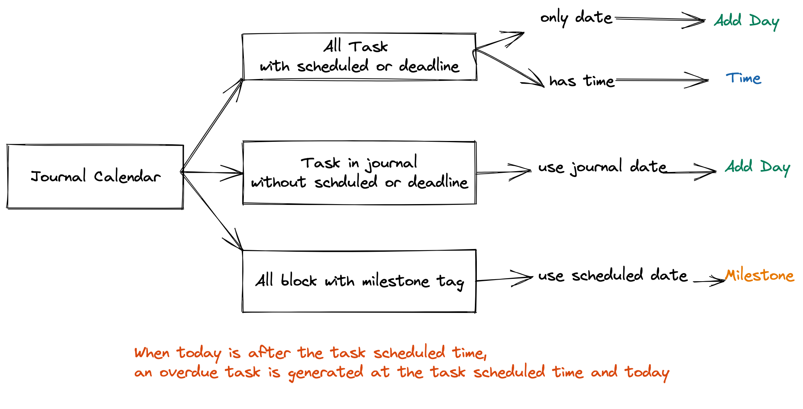

# logseq-plugin-agenda
> A plugin for logseq to show agenda

English | [简体中文](./README-zh_CN.md)

## Demo
We will call notes with `"TODO" "DOING" "NOW" "LATER" "WAITING" "DONE"` as tasks.
### show all task in your notes

journal calendar will collect all tasks with `scheduled` or `deadline` and start time is `scheduled` or `deadline`.

When `scheduled` `deadline` set time, it will be treated as `time` agenda. It will be shown in time line.

Otherwise, it will be treated as `all day` agenda.

### create your own calendar

### show task in your journal

### show your daily log

## Settings

### Default View
default view

### Week Start Day
default week start day

### Journal Date Formatter
default journal date formatter

Fill in the format of your daily diary, for example my diary is `2022-03-07 Mon`, then fill in the` YYYYMMDD DDD`.

[document](https://day.js.org/docs/en/display/format)

### Log Key
Daily log key.

Based on this keyword, the plugin will collect all the contents under the block in the journal and display it in the calendar

There are three situations:
1. Block with time points, such as: 14:00 foo, will be considered `Time` agenda
3. Have a time range, such as: 14: 00-16: 00 foo, will be considered `Time` agenda
2. There is no time point in the block, such as: foo, will be considered `all day` agenda

### Calendars

#### Default Calendar journal

The default Journal calendar will collect the following information and display in the calendar:
1. All tasks with Scheduled or Deadline (using `scheduled`` deadline` as agenda planning time)
2.No scheduled or deadline tasks in all journals
 (using the date of journals as agenda planning time)
3. All Block with a Milestone tag

#### Custom Calendar
The behavior is the same as the journal calendar, but the lookup range changes to the page specified by the custom calendar ID

> The query of all calendars is open and modifiable, and you can customize it according to your needs

Wait for complete document.
