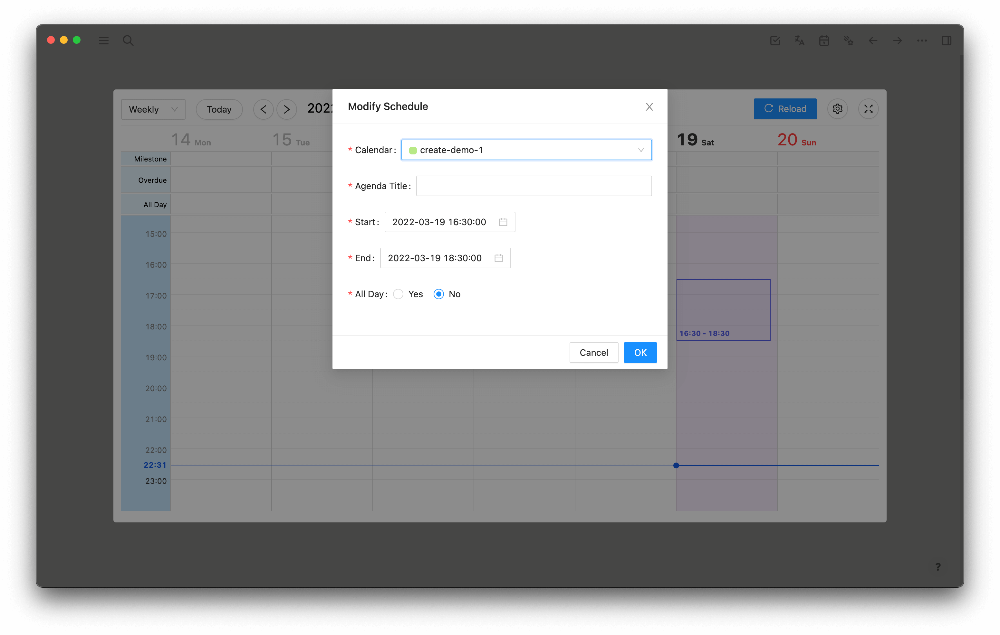

# logseq-plugin-agenda
> A calendar plugin for logseq

[](https://github.com/haydenull/logseq-plugin-agenda/releases)
[](https://github.com/haydenull/logseq-plugin-agenda/blob/main/LICENSE)

Click [here](https://haydenull.github.io/logseq-plugin-agenda/) for the full documentation

<a href="https://www.buymeacoffee.com/haydenull" target="_blank"></a>

## Features
- Supports multiple views: single day, week, double week, month
- Supports dashboard
- Supports changing start day of week
- Supports flexible custom calendar(both simple query and advanced query)
- Supports debugging query
- Supports show overdue tasks
- Supports Milestone
- Supports daily log and export weekly log
- Supports subscription calendar(basic event)
- Supports dark mode
- Supports create and edit agenda
- Supports Gantt View (Both simple and advanced mode)


<!-- 

 -->

## Demo
We will call notes with `"TODO" "DOING" "NOW" "LATER" "WAITING" "DONE"` as tasks.
### show all task in your notes

journal calendar will collect all tasks with `scheduled` or `deadline` and start time is `scheduled` or `deadline`.

When `scheduled` `deadline` set time, it will be treated as `time` task. It will be shown in time line.

Otherwise, it will be treated as `all day` task.

### create your own calendar


### show task in your journal

journal calendar will collect all tasks without `scheduled` or `deadline` in journal notes.

### show your daily log


### Create and edit agenda


## Settings

### Default View
default view

### Week Start Day
default week start day

### Log Key
Daily log key.

Based on this keyword, the plugin will collect all the contents under the block in the journal and display it in the calendar

There are three situations:
1. Block with time points, such as: 14:00 foo, will be considered `Time` agenda
3. Have a time range, such as: 14: 00-16: 00 foo, will be considered `Time` agenda
2. There is no time point in the block, such as: foo, will be considered `all day` agenda

### Calendars

#### Default Calendar journal


The default Journal calendar will collect the following information and display in the calendar:
1. All tasks with Scheduled or Deadline (using `scheduled`` deadline` as agenda planning time)
2.No scheduled or deadline tasks but in journal note
 (using the date of journal note as agenda planning time)
3. All Block with a Milestone tag

#### Custom Calendar
The behavior is the same as the journal calendar, but the lookup range changes to the page specified by the custom calendar ID.

> The query of all calendars is open and modifiable, and you can customize it according to your needs

So how to create a custom calendar?

Click the add calendar button, and fill in the calendar name, and edit [query](https://logseq.github.io/#/page/Queries).

The plugin will call [logseq.DB.datascriptQuery](https://logseq.github.io/plugins/interfaces/IDBProxy.html#datascriptQuery) or [logseq.DB.q](https://logseq.github.io/plugins/interfaces/IDBProxy.html#q) API with the query you specified. and the result will be displayed in the calendar.

Let me explain what the configuration items are:
1. `script`: As a parameter to datascriptQuery, query all block that meets the requirements.
2. `query type`: The type of query, can be [Simple Query](https://logseq.github.io/#/page/Queries) or [Advanced Query](https://logseq.github.io/#/page/AdvancedQueries).
2. `schedule start`: Take the field specified by `schedule start` from the block of the datascriptQuery query as the agenda start time.
3. `schedule end`: Take the field specified by `schedule end` from the block of the datascriptQuery query as the agenda end time.
4. `date formatter`: The date formatter. Use this as [date-fns](https://date-fns.org/v2.28.0/docs/parse) parameter to  convert `schedule start` `schedule end` to an available date.
5. `is milestone`: Whether the block is a milestone. If it is, the block will be displayed in the calendar as a milestone.

If you don't konw how to fill `schedule start` `schedule end`, you can open DevTools and click the play button:


Example:

Currently we have a test-agenda note:

where the custom calendar demo has the `start` `end` attribute, we want it to be displayed in the calendar and the common text is not.


##### Use [Simple Query](https://logseq.github.io/#/page/Queries)

We use the following query script to query the block located in the test-agenda page:

`(and (page "test-agenda") (property end) (property start))`


##### Use [Advanced Query](https://logseq.github.io/#/page/advanced%20queries)

If you want to use the advanced query, you can use the following script:

```clojure
[:find (pull ?block [*])
  :where
  [?block :block/properties ?p]
  [(get ?p :start) ?s]
  [(get ?p :end) ?e]
  [?page :block/name ?pname]
  [?block :block/page ?page]
  [(contains? #{"test-agenda"} ?pname)]]
```

The complete configuration is as follows:


The above two methods are equivalent .The following will appear:


### Subscription Calendar

Subscription is the same as a custom calendar configuration, except that there is no query and url are added.

> At present, only simple events are supported, and there are no functions such as periodic events.
