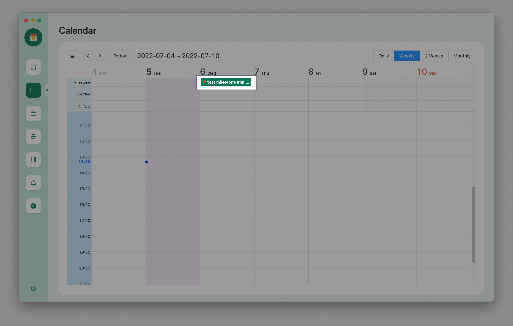

# Events

Events are any blocks in your database that have both a time dimension and a Logseq task property associated with them (e.g. TODO, DOING, LATER, NOW, WAITING)

Events can be in your journal or in any other page. Note that there are slight differences in setting up events in the journal vs in other pages. 

Also note that if you want events to show up in your project dashboard, you have have to insert those blocks in the relevant project page.

## Journal page only

Enter the task on the journal page for that date. If the task starts at a certain time, specify the time at the start of the block. You can also specify the end time, or alternatively the plugin will use your default time for events when displaying the event in your calendar.

### Example:

## All non-journal pages

including pages that are not specified as 'Projects' in the plugin.

The following methods are supported to set event dates:

### With ability to specify times:
- Logseq's built-in SCHEDULED and DEADLINE functionality
- Agenda link: (Right mouse button block dot, select "Modify Schedule")
  
### No ability to specify times: 
- Tasks with a date-reference: e.g. `LATER task [[Jun 10th, 2022]]`
- A user definted start:: and end:: block property to block full days (note: properties are dates in the format 'YYYY-MM-DD'.)

### Example:

## Milestone: A special kind of event

When an event contains a milestone tag, it is displayed separately on the calendar.

### Example:

