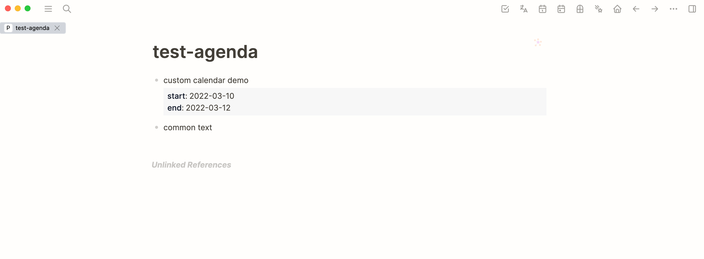
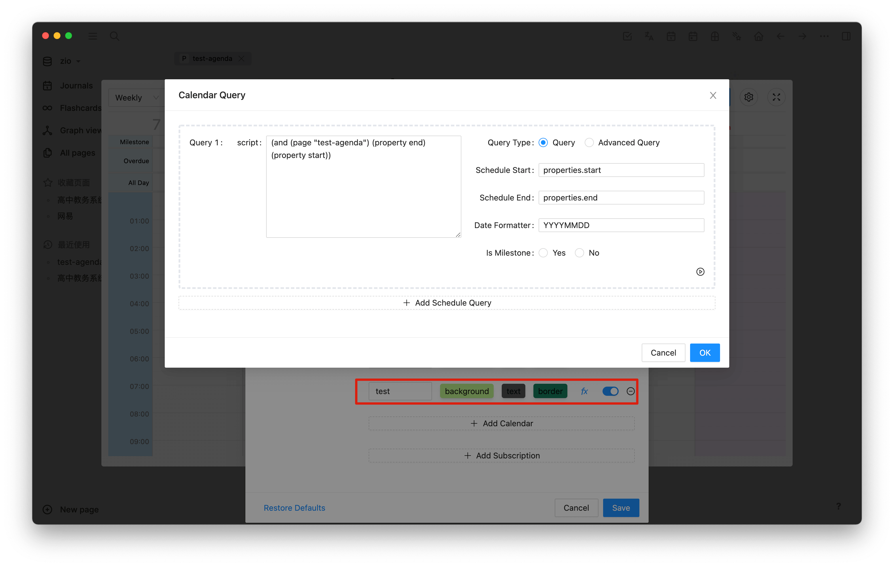

# 普通自定义日历

### 自定义日历
行为同 journal 日历, 但是查找范围变为了自定义日历 id 指定的页面

> 所有日历的 query 都是开放可修改的, 你可以根据需求自己定制

那么如何定制玩去属于自己的日历呢?

答案是新建日历,然后修改 [query](https://logseq.github.io/#/page/Queries)

插件会以填写的 query script 作为参数调用[logseq.DB.datascriptQuery](https://logseq.github.io/plugins/interfaces/IDBProxy.html#datascriptQuery) 或 [logseq.DB.a](https://logseq.github.io/plugins/interfaces/IDBProxy.html#q)API, 然后将结果展示在日历中.

让我来解释一下有哪些配置项:
1. `script`: 作为 datascriptQuery 的参数, 查询所有符合要求的 block
2. `query type`: query 的类型, 可以是 [Simple Query](https://logseq.github.io/#/page/Queries) 或 [Advanced Query](https://logseq.github.io/#/page/AdvancedQueries)
2. `schedule start`: 从 datascriptQuery 查询的 block 取出 `schedule start` 指定的字段作为 agenda 开始时间
3. `schedule end`: 从 datascriptQuery 查询的 block 取出 `schedule end` 指定的字段作为 agenda 结束时间
4. `date formatter`: 日期格式, 以此为参数使用 [date-fns](https://date-fns.org/v2.28.0/docs/parse) 将 `schedule start` `schedule end` 转换为可用的日期
5. `is milestone`: 是否是里程碑, 如果是, 则会展示在日历的 Milestone 中

如果你不知道如何填写 `schedule start` `schedule end`, 可以打开控制台, 然后点击 play 按钮:


示例:

当前我们有一个 test-agenda 的笔记:

其中 custom calendar demo 具有 `start` `end` 属性, 我们想让它显示在日历中,而 common text 不显示.




#### 使用 [Simple Query](https://logseq.github.io/#/page/Queries)

我们使用如下 query script 查询位于 test-agenda 页面中的 block:

`(and (page "test-agenda") (property end) (property start))`



#### 使用 [advanced query](https://logseq.github.io/#/page/advanced%20queries)

如果你更喜欢advanced query, 配置如下:

```clojure
[:find (pull ?block [*])
  :where
  [?block :block/properties ?p]
  [(get ?p :start) ?s]
  [(get ?p :end) ?e]
  [?page :block/name ?pname]
  [?block :block/page ?page]
  [(contains? #{"test-agenda"} ?pname)]]
```

完整配置如下图:


以上两种方式是等效的,最终日历中会显示以下内容:

