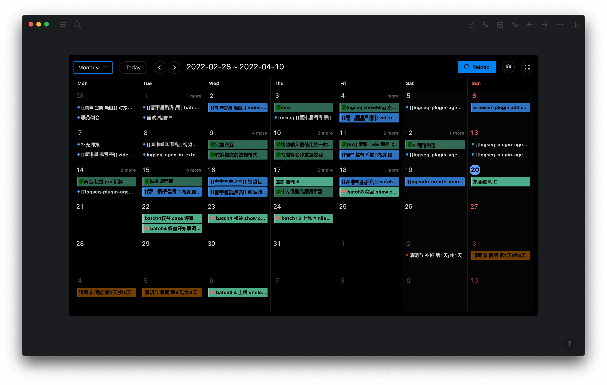

# 设置

## Theme
主题
- Auto：依据 logseq 主题自动选择
- Light：亮色主题
- Dark：暗色主题

## Default View
默认视图
- Daily: 日视图
- Weekly: 周视图
- 2 Weeks: 双周视图
- Monthly: 月视图

## Week Start Day
周开始日
- Sunday: 星期日
- Monday: 星期一

## Time Grid
设置周视图与日视图中的时间网格的开始与结束时间。均为0-24的数字。

## ~~Journal Date Formatter(废弃)~~
~~日记日期格式~~

~~依据自己每日日记的格式填写,例如我的日记是 `2022-03-07 Mon`,那么就填写 `YYYYMMDD ddd`~~

::: warning 注意
1.8.1 版本移除了 journalDateFormatter 设置，改为自行从 logseq 获取，非常遗憾的是这个改动影响了原本的日期解析，如果你遇到报错 `Use yyyy instead of YYYY (in YYYYMMDD) for formatting` ，请在设置中点击 fx 按钮，将所有的 `YYYYMMDD` 改为 `yyyyMMdd`

现在插件使用 [date-fns](https://date-fns.org/v2.28.0/docs/parse) 解析日期。
:::

## Log Key
每日日志的关键字

点击 [这里](../event/dailylog.md) 查看详情

## Default Duration
事件默认时长

在开始时间的基础上,添加默认时长

## Calendar
日历

下载插件后会默认创建一个名为 journal 的默认日历, 点击 [这里](../event/journal.md) 查看详情

如果你想添加自己的日历, 点击 [这里](../calendar/README.md) 查看自定义日历文档

## Subscription
订阅在线日历, 点击 [这里](../calendar/subscription.md) 查看详情